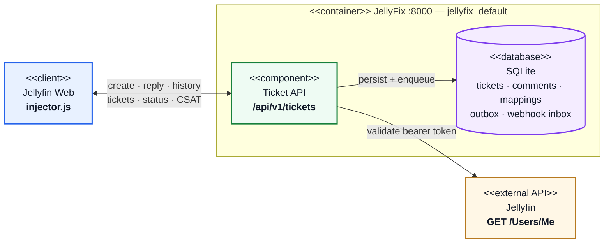
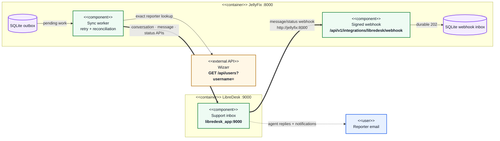
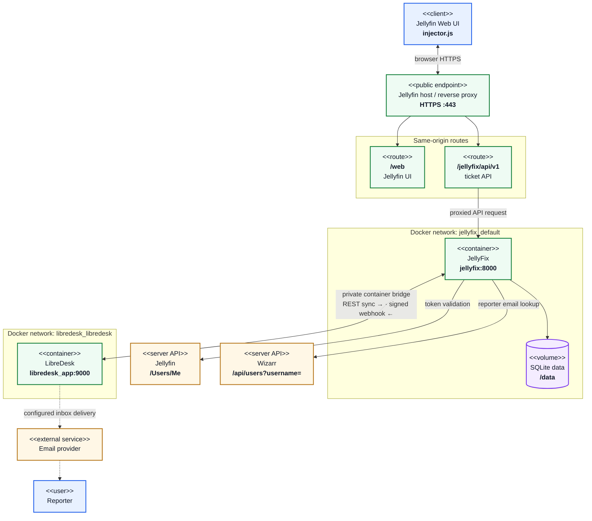
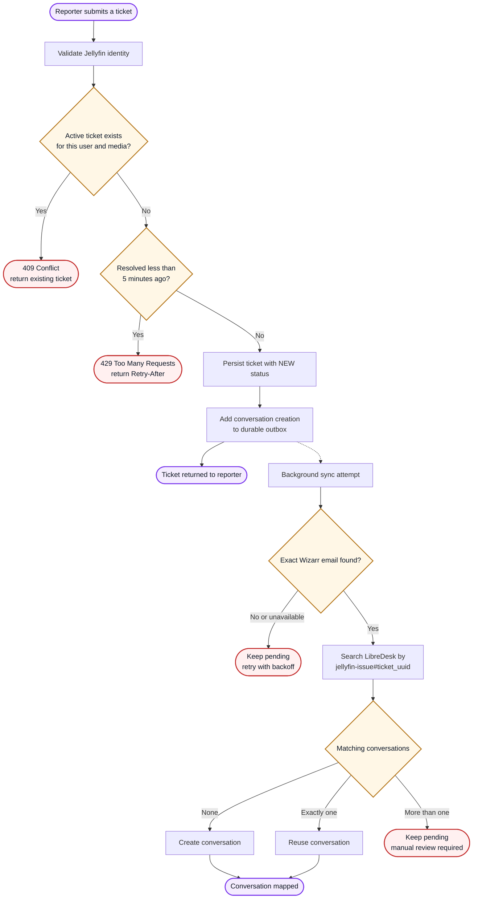
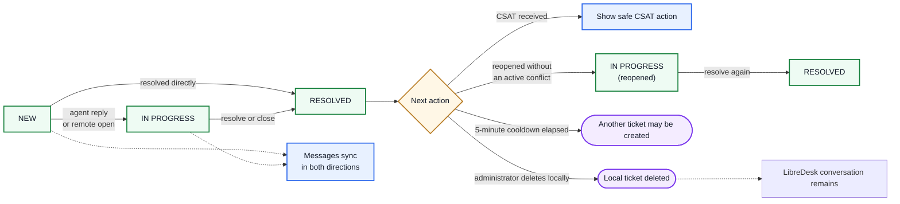

# JellyFix

JellyFix adds issue reporting and ticket history to Jellyfin Web. A small browser injector talks to a FastAPI backend that validates Jellyfin users, stores tickets in SQLite, and synchronizes support conversations with LibreDesk.

## Features

- Server-verified Jellyfin identity and administrator permissions
- One active ticket per user and media item, with unlimited resolved history
- Five-minute cooldown after resolution with `429` and `Retry-After`
- User ticket history and administrator Ticket Manager
- Durable SQLite queues for Wizarr and LibreDesk outages
- Bidirectional LibreDesk messages and status synchronization
- Safe CSAT links and SQLite migration backups

### Request and data path



### LibreDesk synchronization bridge



JellyFix is attached to both `jellyfix_default` and `libredesk_libredesk`. The thick arrows are private container-to-container traffic over `libredesk_libredesk`; no public LibreDesk route is required.

### Network topology



Browser traffic stays on the Jellyfin HTTPS origin. JellyFix performs authentication, Wizarr lookup, and LibreDesk synchronization as server-to-server requests; only the LibreDesk bridge uses the shared private Docker network.

## Ticket lifecycle

### Creation and delivery



Each pending delivery is retried in a later worker cycle. A failed external integration never removes the local ticket.

### Status and conversation flow



## Quick start

1. Copy `.env.example` to `.env` and set your deployment values.
2. Create the credential files described in the integration guides.
3. Ensure the external LibreDesk Docker network exists when LibreDesk is enabled.
4. Build and start JellyFix:

```powershell
docker compose up --build -d
docker compose ps
```

The Compose service exposes JellyFix on host port `18000`. Runtime data is stored in `backend/data` and mounted at `/data`.

Integration setup:

- [LibreDesk setup](docs/libredesk_setup.md)
- [Wizarr setup](docs/wizarr_setup.md)

## Injector

Install `frontend/injector.js` in Jellyfin Web using a JavaScript injector plugin. JellyFix must be reachable from the Jellyfin browser origin under `/jellyfix` because the injector uses:

```javascript
window.location.origin + "/jellyfix/api/v1"
```

After replacing the script, clear the Jellyfin Web cache or hard-refresh the browser.

## API

All routes except health and the signed LibreDesk webhook require a Jellyfin bearer token.

```text
GET    /api/v1/healthz
GET    /api/v1/me
GET    /api/v1/items/{item_id}/ticket
POST   /api/v1/tickets
GET    /api/v1/tickets/mine
GET    /api/v1/tickets/{ticket_id}
POST   /api/v1/tickets/{ticket_id}/comments
PATCH  /api/v1/tickets/{ticket_id}/status
PATCH  /api/v1/tickets/status
DELETE /api/v1/tickets/{ticket_id}
DELETE /api/v1/tickets
GET    /api/v1/admin/tickets
POST   /api/v1/integrations/libredesk/webhook
```

## Development

Use the repository virtual environment:

```powershell
.\.venv\Scripts\Activate.ps1
python -m pip install -r backend\requirements.txt
python -m unittest discover -s backend -p "test_*.py" -v
```

Run locally:

```powershell
Set-Location backend
$env:JELLYFIX_ENV='development'
$env:JELLYFIN_URL='http://localhost:8096'
$env:PUBLIC_ORIGIN='http://localhost:8000'
$env:TRUSTED_HOSTS='localhost:8000'
python -m uvicorn main:app --reload --port 8000
```

Release checks:

```powershell
python -m coverage run -m unittest discover -s backend -p "test_*.py"
python -m coverage report --show-missing
python -m compileall -q backend\app backend\main.py
node --check frontend\injector.js
docker compose config --quiet
git diff --check
```

## Security and data

Do not commit `.env`, `secrets/`, SQLite databases, migration backups, or credential exports. JellyFix derives user identity and administrator status from Jellyfin and renders browser content with DOM text APIs.
