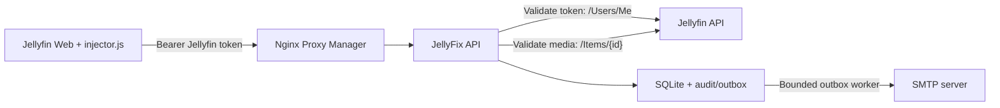

# JellyFix

JellyFix is a secure Jellyfin Web issue reporter. It adds one English browser injector to Jellyfin Web and stores tickets in a FastAPI/SQLite backend.

The current remake replaces the old unauthenticated API and dashboard with a token-validated API under `/jellyfix/api/v1`.

## Architecture diagram


## Current Behavior

- Users report media issues from Jellyfin Web through `frontend/injector.js`.
- Every API route except health requires `Authorization: Bearer <Jellyfin access token>`.
- The backend validates that token against Jellyfin `/Users/Me` on every request.
- User ID, display name and administrator status come from Jellyfin, not from the browser.
- Ticket creation validates media access through Jellyfin and derives the media name server-side.
- Only the ticket reporter and verified Jellyfin administrators can read or comment on a ticket.
- Administrators manage tickets inside the injector modal, not a separate `/admin` page.
- The UI uses DOM APIs and blocks HTML parsing/code execution sinks in tests.
- SQLite data is stored in `/data/tickets.db` inside the container.

Removed legacy routes:

```text
/admin
/all_tickets
/status/*
/comments
PUT /tickets/{id}/status
```

Active routes:

```text
GET   /jellyfix/api/v1/healthz
GET   /jellyfix/api/v1/me
GET   /jellyfix/api/v1/items/{item_id}/ticket
POST  /jellyfix/api/v1/tickets
GET   /jellyfix/api/v1/tickets/{ticket_id}
POST  /jellyfix/api/v1/tickets/{ticket_id}/comments
PATCH /jellyfix/api/v1/tickets/{ticket_id}/status
PATCH /jellyfix/api/v1/tickets/status                         # JSON body: {"ticket_ids":[...],"status":"resolved"}
DELETE /jellyfix/api/v1/tickets/{ticket_id}
DELETE /jellyfix/api/v1/tickets                         # JSON body: {"ticket_ids":[...]}, max 100
GET   /jellyfix/api/v1/admin/tickets
```

## Docker Deployment

The Compose service publishes JellyFix directly on host port `18000`:

```yaml
ports:
  - "18000:8000"
```


Runtime hardening in `docker-compose.yml`:

- non-root container user `10001:10001`
- read-only root filesystem
- writable `/data`
- temporary `/tmp`
- dropped Linux capabilities
- `no-new-privileges:true`

Start or recreate:

```powershell
docker compose up --build -d
```

Check status:

```powershell
docker compose ps
docker compose logs -f jellyfix
```

Health check from the host:

```powershell
Invoke-WebRequest -UseBasicParsing -Headers @{Host='your-jellyfin.example'} http://127.0.0.1:18000/api/v1/healthz
```

The `Host` header must match `TRUSTED_HOSTS`.

## Required Configuration

Copy `.env.example` to `.env` and set values for your deployment:

```dotenv
JELLYFIX_ENV=production
ROOT_PATH=/jellyfix
JELLYFIN_URL=http://host.docker.internal:8096
PUBLIC_ORIGIN=https://your-jellyfin.example
TRUSTED_HOSTS=your-jellyfin.example
STORAGE_PATH=/data
DATABASE_PATH=/data/tickets.db
ALLOW_ACTIVE_TICKET_DELETION=false

SMTP_SERVER=
SMTP_PORT=587
SMTP_USER=
SMTP_PASSWORD_FILE=/run/secrets/smtp_password
EMAIL_FROM=
EMAIL_TO=
```

Important:

- `JELLYFIN_URL` is the URL JellyFix uses from inside the container to reach Jellyfin.
- `PUBLIC_ORIGIN` must exactly match the browser origin that loads Jellyfin Web, including scheme and port when non-default.
- `TRUSTED_HOSTS` must include the HTTP host JellyFix receives.
- If Jellyfin runs on the Windows host, `http://host.docker.internal:8096` works from Docker Desktop.
- Do not keep SMTP passwords inline in `.env`; put the password in `secrets/smtp_password`.
- Ticket deletion is administrator-only. By default, only resolved tickets can be deleted; set `ALLOW_ACTIVE_TICKET_DELETION=true` only when administrators must also delete new or in-progress tickets.

SMTP is optional. When configured, JellyFix sends plain-text new-ticket notifications through a bounded outbox.

## Injector Deployment

Use only:

```text
frontend/injector.js
```

For convenience use javascript injector plugin from https://github.com/n00bcodr/Jellyfin-JavaScript-Injector

The injector expects the API at:

```javascript
window.location.origin + "/jellyfix/api/v1"
```

That means JellyFix should be reachable from the same browser origin as Jellyfin Web under `/jellyfix`. If you expose only `:18000` directly, either your public routing must still serve it under the same Jellyfin origin, or the injector API base must be changed intentionally.

After replacing the injector in Jellyfin Web, clear browser cache or hard-refresh so old injected code is not reused.


## Development

Install dependencies:

```powershell
python -m pip install -r backend\requirements.txt
```

Run the API locally:

```powershell
Set-Location backend
$env:JELLYFIX_ENV='test'
$env:JELLYFIN_URL='http://localhost:8096'
$env:PUBLIC_ORIGIN='http://localhost:8000'
$env:TRUSTED_HOSTS='localhost:8000'
python -m uvicorn main:app --reload --port 8000
```

Run tests:

```powershell
Set-Location backend
$env:PYTHONDONTWRITEBYTECODE='1'
python -m unittest -v test_security.py
```

Useful validation commands:

```powershell
node --check frontend\injector.js
rg "innerHTML|outerHTML|insertAdjacentHTML|document\.write|eval\(" frontend\injector.js
docker compose config
```

The `rg` command should return no matches.

## Security Notes

- no client-supplied identity or admin flag
- no unauthenticated ticket mutation
- no separate backend-rendered admin dashboard
- no wildcard CORS
- strict body size and Pydantic validation
- bounded ticket/comment quotas
- plain-text email outbox with capped retries
- no HTML string rendering in the injector
